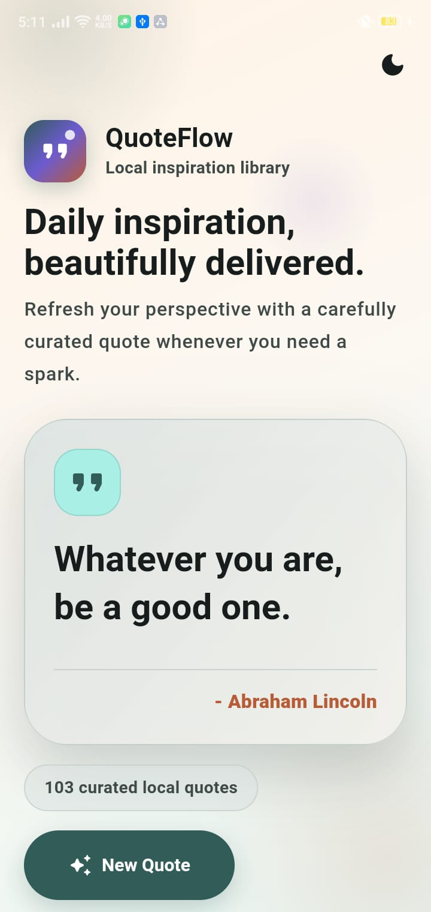
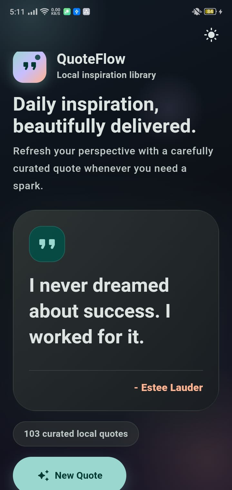

# QuoteFlow

QuoteFlow is a Flutter random quote generator created for the CodeAlpha Flutter Development Internship. It delivers a curated local collection of inspirational quotes through a responsive Material 3 interface with smooth quote transitions and light/dark theme support.

The app runs fully offline. Quotes are stored locally in the project, so the experience is fast, dependable, and does not require an API, Firebase, or a database.

## Features

- Random quote shown when the home screen loads
- New Quote button with no consecutive duplicate quote
- 100+ curated local quotes
- Material 3 light and dark themes
- Session-based theme toggle
- Responsive layout for phones, tablets, and landscape screens
- Smooth animated quote transitions
- Accessibility labels for the quote content and quote count
- Offline-first local repository

## Architecture

QuoteFlow uses a feature-first Flutter structure. Shared app code lives in `lib/core`, while quote-specific data, state management, screens, and widgets live in `lib/features/quotes`.

Routing is handled by GoRouter. App state is managed with Riverpod. The UI uses Material 3 theming with custom light and dark color schemes.

## Folder Structure

```text
lib/
  core/
    constants/
    router/
    theme/
    utils/
    widgets/
  features/
    quotes/
      data/
        models/
        repository/
      presentation/
        providers/
        screens/
        widgets/
assets/
  screenshots/
android/
test/
web/
```

## Technologies

- Flutter
- Dart
- Material 3
- Riverpod
- GoRouter
- Android Gradle Plugin
- Kotlin

## Dependencies

- `flutter_riverpod`
- `go_router`
- `google_fonts`
- `cupertino_icons`
- `flutter_lints`

## Installation

```bash
flutter pub get
```

## Run Instructions

Run on a connected Android device or emulator:

```bash
flutter run
```

Build a debug APK:

```bash
flutter build apk --debug
```

## Quality Checks

```bash
dart format .
flutter analyze
flutter test
flutter build apk --debug
```

## Screenshots

| Home Light Theme | Home Dark Theme |
| --- | --- |
|  |  |

## Author

Maira Sarwar

GitHub: [mairasarwar132](https://github.com/mairasarwar132)

## Future Improvements

- Favorite quotes
- Quote categories
- Share quote action
- Daily quote notification
- Export quote as image
